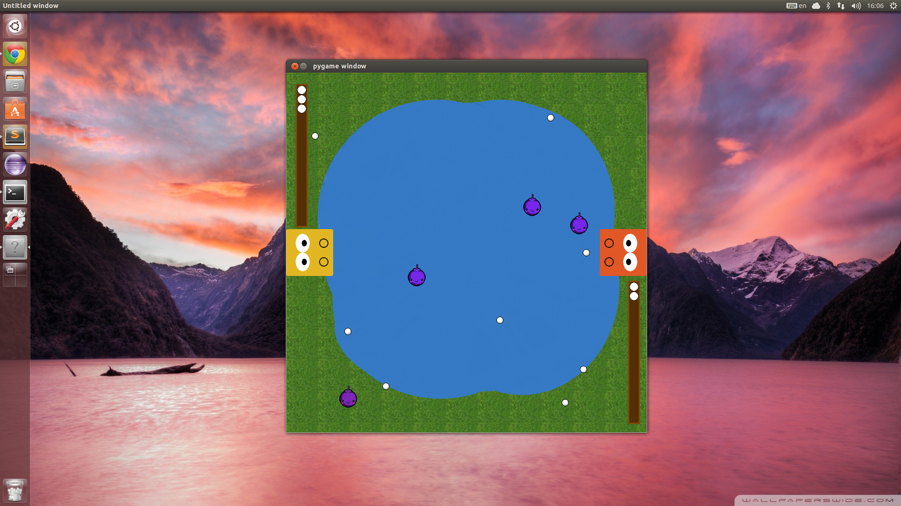
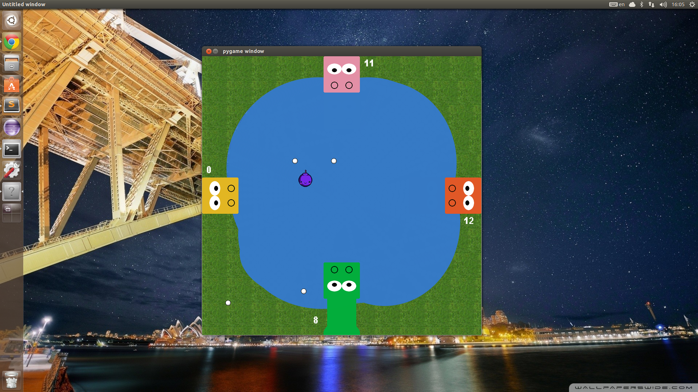

## Hungry Hippos - Pygame

A game of Hungry Hippos created in Python using Pygame.

## Consists of 3 game modes:
	Inifinte mode - Balls come infinitley at increased speed, how long can you last?!
	Multiplayer mode - Play friends with 2 -4 players.
	Singleplayer mode - Play on your own against 3 other automated players.

## How to play:

Play with the keys q (player 1), p (player 2), z (player 3), m (player 4).

Eat as many balls as you can whilst avoiding the bombs!

Eating balls adds 1 to your score, eating bombs will deduct two points from your score.

[]

[]
